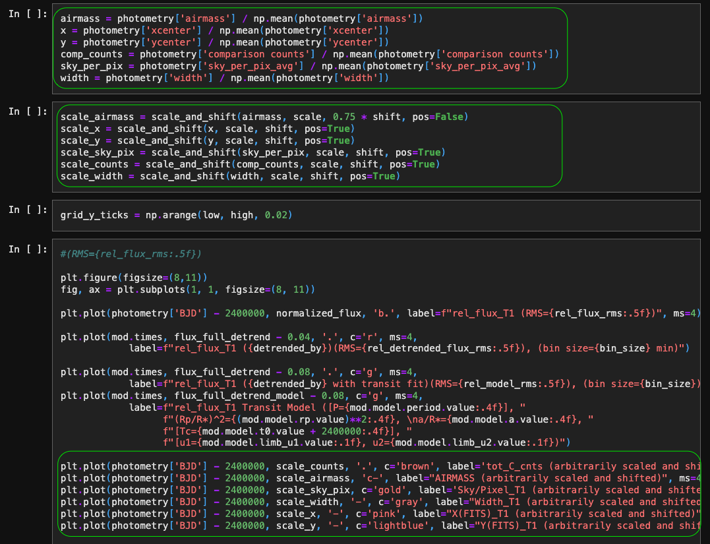

Moving code from a notebook into a function or class
====================================================

Some of the development of ``stellarphot`` ends up happening in Jupyter
notebooks. Eventually that code really ought to move into a function or
class and ideally have some tests written for it.

This is often relatively straightforward, if somewhat painful.

An outline of the steps required is:

1.  Decided how to break up the code in the notebook. When in doubt, start by
    breaking the code in the notebook into relatively small chunks.
2.  Move the code from the notebook into a function or class into a
    ``stellarphot`` file. You will need to decide where to put the new
    code in ``stellarphot``. You will also need to identify the variables
    that are used in the code and pass them as arguments to the function
    or class.
3.  Import the new function into the notebook you moved the code from. Try to
    run the code in the notebook and make sure it still works.
4.  Write tests for the new function or class. Put the test into the ``tests``
    folder in the same directory as the ``stellarphot`` file you created.

Example
-------

The following example is based on the notebook
``stellarphot/notebooks/photometry/06-transit-fit-template.ipynb``. If you
look at the notebook at `the git commit 05f11bb`_ you will see that it
contains a number of cells that graph the airmass and several other things
below a transit fit. The specific cells are circled in the image below.

Note that there are not that many inputs to the code in those cells. They need
the photometry table and a few other parameters.

The code in those cells was moved into the function
`stellarphot.plotting.plot_many_factors`. The notebook was modified in
`this commit`_ to drop the code in the cells and replace it with a call to
`stellarphot.plotting.plot_many_factors`.

.. _`the git commit 05f11bb`: https://github.com/feder-observatory/stellarphot/blob/05f11bb0c8e9f32f00a3b90536f297ef4c6ad9ec/stellarphot/notebooks/photometry/06-transit-fit-template.ipynb
.. _`this commit`: https://github.com/feder-observatory/stellarphot/commit/18e1a00a8947b106b6789f5a9c944fe0d81861d5
