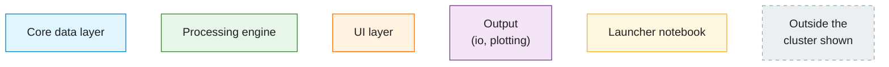
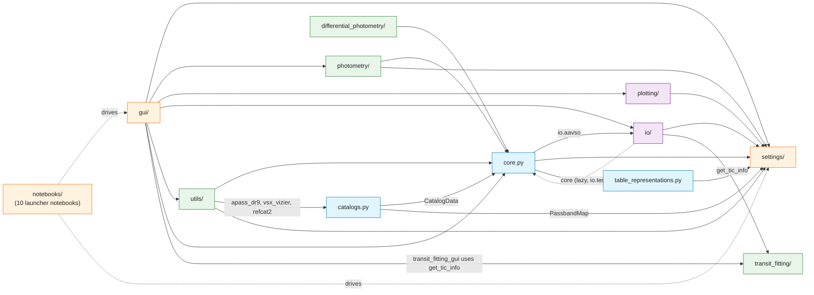
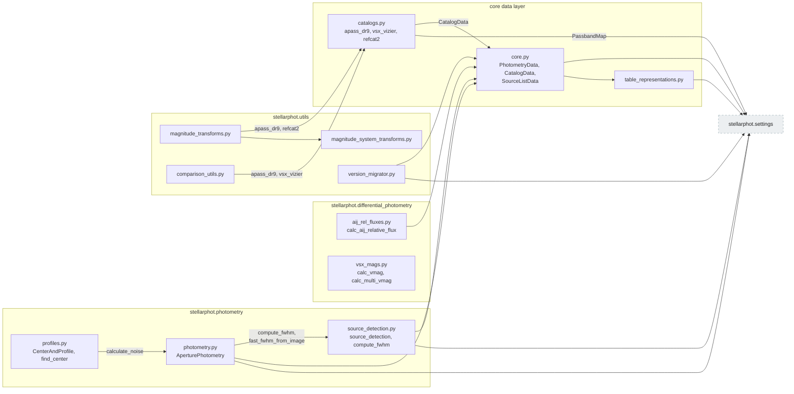
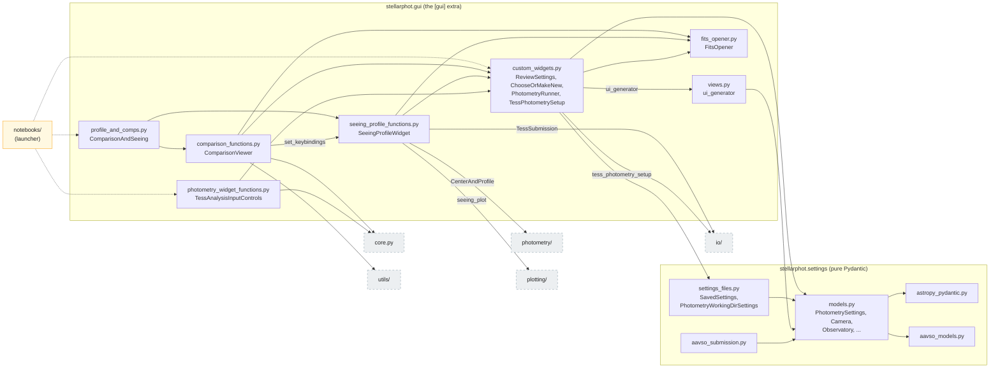
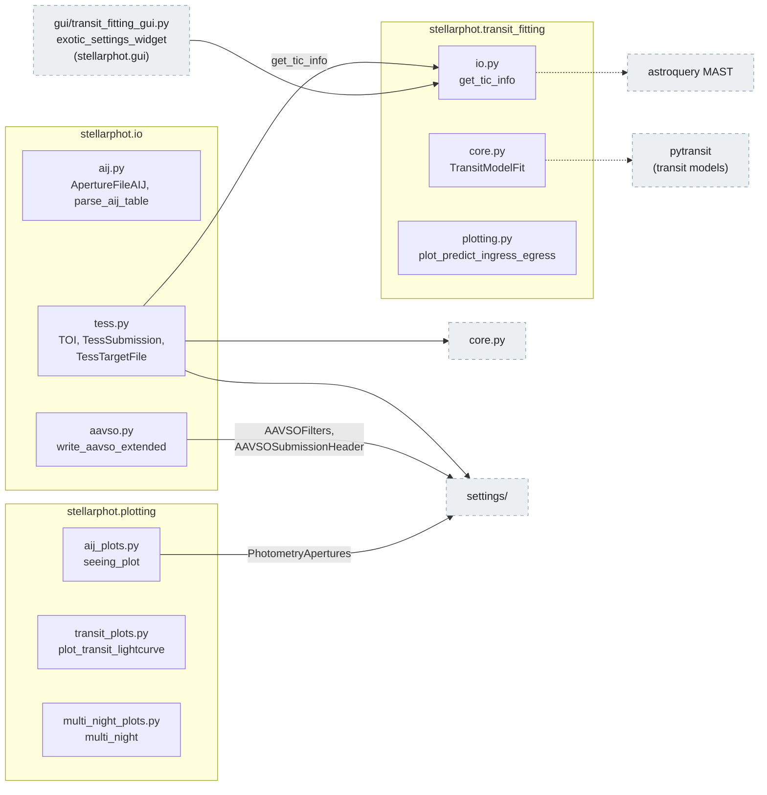

# stellarphot — Package Overview

This page maps every module in the `stellarphot` package and the import
relationships between them. The package has no command-line scripts; users
interact with it through Jupyter notebooks (launched via
`jupyter-app-launcher`), through ipywidgets-based GUI tools, or by importing
the library directly.

The modules group into these logical components:

| Component | Modules | Role |
|---|---|---|
| **Core data layer** | `core.py`, `catalogs.py`, `table_representations.py` | Validated astropy `QTable` subclasses (`PhotometryData`, `CatalogData`, `SourceListData`) in `core.py`; catalog-fetcher functions (`apass_dr9`, `vsx_vizier`, `refcat2`) in `catalogs.py`; YAML (de)serialization of settings stored in table metadata |
| **Settings & configuration** | `settings/` | Pydantic models for all configuration and saved-settings file management — pure Pydantic, no GUI imports |
| **Photometry engine** | `photometry/` | Source detection, FWHM measurement, aperture photometry pipeline |
| **Differential photometry** | `differential_photometry/` | Relative flux (AIJ-style) and variable-star magnitude calculations |
| **Transit fitting** | `transit_fitting/` | Exoplanet transit modeling (pytransit), TIC/MAST queries (the EXOTIC helper GUI moved to `gui/`) |
| **Input/output** | `io/` | AstroImageJ, AAVSO extended format, TESS/TFOP files |
| **GUI layer** | `gui/` | All notebook/widget UI, consolidated here so the rest of the package stays headless: the settings-form generator (`views.py`), settings widgets (`custom_widgets.py`), file chooser (`fits_opener.py`), seeing-profile/comparison-star widgets, and the EXOTIC helper. Requires the optional `[gui]` extra |
| **Plotting** | `plotting/` | Seeing, transit, and multi-night light-curve plots |
| **Utilities** | `utils/` | Magnitude calibration/transforms, comparison-star helpers, version migration |
| **Notebooks** | `notebooks/` | Shipped workflow notebooks (the user-facing entry points) |

**Legend** — the node types used on this page:

- **Solid arrows** — an import, pointing from the importing module to the one
  it imports.
- **Dashed arrows** — notebooks driving a UI layer, or other looser links.
- Files are grouped into labeled **subgraphs** by subpackage in the
  cluster diagrams.

## Subpackage dependency map

Arrows point from the importing module to the module it imports.
The notebooks drive the GUI layers (dashed arrows) and, through them, the rest
of the package.

*Arrows: **solid** = an import (importer → imported); **dashed** = a notebook driving a UI layer, or a looser link.*

*Source: the [stellarphot/](../stellarphot/) package — each box is a subpackage directory or top-level module.*

Notes:

- The notebooks also import `differential_photometry`, `transit_fitting`,
  `io`, `plotting`, `utils`, and the top-level `stellarphot` package directly;
  only the two main dashed edges are drawn to keep the diagram readable.
- `core.py` and `io` reference each other, but the import order is one-way at
  load time. `core.py` imports `io/aavso.py` (for `write_aavso_extended`) at the
  top of the file, and `io/aavso.py` does **not** import `core.py`. The only
  `io` module that imports `core.py` is `io/tess.py`, which is exposed lazily by
  `io/__init__.py` (a module-level `__getattr__`), so it is loaded only on first
  use — after `core.py` has finished importing. This replaces the previous
  in-method lazy import that worked around a genuine `core ↔ io` cycle.

## Core + pipeline cluster (file level)

The photometry pipeline, differential photometry, and calibration utilities
all sit on top of the core data layer.

*Arrows: **solid** = an import (importer → imported); **dashed** = a notebook driving a UI layer, or a looser link.*

Key contents of each file:

- [`core.py`](../stellarphot/core.py) — `BaseEnhancedTable` (validated `QTable`) and its subclasses
  `PhotometryData`, `CatalogData`, `SourceListData` (table data structures only).
- [`catalogs.py`](../stellarphot/catalogs.py) — catalog-fetcher functions
  `apass_dr9()`, `refcat2()`, `vsx_vizier()` that build a `CatalogData` from
  Vizier/astroquery. Still importable from `stellarphot.core` via a deprecated shim.
- [`table_representations.py`](../stellarphot/table_representations.py) — `generate_table_representers()`,
  `serialize_models_in_table_meta()`, `deserialize_models_in_table_meta()`
  (round-trips pydantic settings models stored in table metadata).
- [`photometry/photometry.py`](../stellarphot/photometry/photometry.py) — `AperturePhotometry`,
  `single_image_photometry()`, `multi_image_photometry()`,
  `find_too_close()`, `clipped_sky_per_pix_stats()`, `calculate_noise()`.
- [`photometry/source_detection.py`](../stellarphot/photometry/source_detection.py) — `source_detection()`,
  `compute_fwhm()`, `fast_fwhm_from_image()`.
- [`photometry/profiles.py`](../stellarphot/photometry/profiles.py) — `find_center()`, `CenterAndProfile`
  (radial profile, curve of growth, SNR).
- [`differential_photometry/aij_rel_fluxes.py`](../stellarphot/differential_photometry/aij_rel_fluxes.py) — `calc_aij_relative_flux()`,
  `add_relative_flux_column()`, `add_in_quadrature()`.
- [`differential_photometry/vsx_mags.py`](../stellarphot/differential_photometry/vsx_mags.py) — `calc_vmag()`, `calc_multi_vmag()`.
- [`utils/magnitude_transforms.py`](../stellarphot/utils/magnitude_transforms.py) — `transform_to_catalog()`,
  `calculate_transform_coefficients()`, `transform_magnitudes()`,
  `filter_transform()`.
- [`utils/magnitude_system_transforms.py`](../stellarphot/utils/magnitude_system_transforms.py) — `PanStarrs1ToJohnsonCousins`,
  `USNOPrimeToSDSSDR7`, `transform_apass_bands()`, `transform_refcat2_bands()`.
- [`utils/comparison_utils.py`](../stellarphot/utils/comparison_utils.py) — `set_up()`, `crossmatch_APASS2VSX()`,
  `mag_scale()`, `in_field()`, `read_file()`.
- [`utils/version_migrator.py`](../stellarphot/utils/version_migrator.py) — `VersionMigrator` (stellarphot 1 → 2 data).

## UI cluster (gui + settings, file level)

The entire widget layer now lives in `stellarphot.gui`: the auto-generated
settings forms (`views.py`, `ui_generator`), the settings widgets
(`custom_widgets.py`), the file chooser (`fits_opener.py`), and the
seeing-profile/comparison-star widgets. It is built on top of the pure-Pydantic
`stellarphot.settings` package (`models.py`, `settings_files.py`).

`stellarphot.settings` is **data-only**: importing it (and hence
`import stellarphot` and the core data layer) loads only the pydantic models and
file handling, never the GUI stack. The GUI libraries
(`ipywidgets`/`ipyautoui`/`astrowidgets`/`ginga`) are confined to
`stellarphot.gui` and ship only with the optional `[gui]` extra, so a base
install stays headless; importing `stellarphot.gui` is what pulls them in.

*Arrows: **solid** = an import (importer → imported); **dashed** = a notebook driving a UI layer, or a looser link.*

Key contents of each file:

- [`settings/models.py`](../stellarphot/settings/models.py) — pydantic models: `Camera`, `Observatory`,
  `PhotometryApertures`, `SourceLocationSettings`,
  `PhotometryOptionalSettings`, `PassbandMap`/`PassbandMapEntry`,
  `LoggingSettings`, `PhotometrySettings` (the aggregate), `Exoplanet`,
  `PhotometryRunSettings`, `PartialPhotometrySettings`.
- [`settings/astropy_pydantic.py`](../stellarphot/settings/astropy_pydantic.py) — pydantic validators for astropy types
  (`UnitType`, `QuantityType`, `EquivalentTo`, `WithPhysicalType`,
  `AstropyValidator`).
- [`settings/settings_files.py`](../stellarphot/settings/settings_files.py) — `SavedSettings` (per-user storage of
  cameras/observatories/passband maps), `PhotometryWorkingDirSettings`
  (loads/saves `photometry_settings.json` in the working directory).
- [`gui/views.py`](../stellarphot/gui/views.py) — `ui_generator()` (builds an `ipyautoui` widget from
  any pydantic model).
- [`gui/custom_widgets.py`](../stellarphot/gui/custom_widgets.py) — `ChooseOrMakeNew`, `Confirm`,
  `SettingWithTitle`, `ReviewSettings`, `PhotometryRunner`,
  `TessPhotometrySetup`, `Spinner`.
- [`gui/fits_opener.py`](../stellarphot/gui/fits_opener.py) — `FitsOpener` (file chooser + lazy
  `CCDData`/header access).
- [`gui/seeing_profile_functions.py`](../stellarphot/gui/seeing_profile_functions.py) — `SeeingProfileWidget`,
  `set_keybindings()`.
- [`gui/comparison_functions.py`](../stellarphot/gui/comparison_functions.py) — `ComparisonViewer`,
  `make_markers()`.
- [`gui/photometry_widget_functions.py`](../stellarphot/gui/photometry_widget_functions.py) — `TessAnalysisInputControls`,
  `filter_by_dates()`.
- [`gui/profile_and_comps.py`](../stellarphot/gui/profile_and_comps.py) — `ComparisonAndSeeing` (combines the
  seeing and comparison widgets).

## Output / IO cluster (file level)

*Arrows: **solid** = an import (importer → imported); **dashed** = a notebook driving a UI layer, or a looser link.*

Key contents of each file:

- [`io/aij.py`](../stellarphot/io/aij.py) — `ApertureAIJ`, `MultiApertureAIJ`, `ApertureFileAIJ`,
  `Star`, `generate_aij_table()`, `parse_aij_table()` (AstroImageJ
  compatibility).
- [`io/aavso.py`](../stellarphot/io/aavso.py) — `write_aavso_extended()` plus field
  validators/formatters for the AAVSO extended file format.
- [`io/tess.py`](../stellarphot/io/tess.py) — `TessSubmission` (TFOP file naming), `TOI` (transit
  parameters fetched by TIC ID), `TessTargetFile` (nearby GAIA sources),
  `tess_photometry_setup()`.
- [`transit_fitting/core.py`](../stellarphot/transit_fitting/core.py) — `TransitModelFit`, `TransitModelOptions`.
- [`gui/transit_fitting_gui.py`](../stellarphot/gui/transit_fitting_gui.py) — EXOTIC settings widget and TIC/TOI
  population helpers.
- [`transit_fitting/io.py`](../stellarphot/transit_fitting/io.py) — `get_tic_info()` (MAST catalog query).
- [`transit_fitting/plotting.py`](../stellarphot/transit_fitting/plotting.py) — `plot_predict_ingress_egress()`.
- [`plotting/aij_plots.py`](../stellarphot/plotting/aij_plots.py) — `seeing_plot()`.
- [`plotting/transit_plots.py`](../stellarphot/plotting/transit_plots.py) — `plot_transit_lightcurve()`,
  `plot_many_factors()`, `bin_data()`, `scale_and_shift()`.
- [`plotting/multi_night_plots.py`](../stellarphot/plotting/multi_night_plots.py) — `plot_magnitudes()`, `multi_night()`.

## External dependencies (major ones per component)

| Component | Major external dependencies |
|---|---|
| Core data layer | astropy (QTable, SkyCoord, Time, units), astroquery (Vizier, XMatch), pandas, lightkurve — no GUI stack at import time |
| Photometry engine | photutils (apertures, DAOStarFinder, centroids, profiles), astropy, ccdproc |
| Settings | pydantic only — no GUI dependencies (the widget layer moved to `stellarphot.gui`) |
| Transit fitting | pytransit, astropy.modeling, scipy, astroquery (MAST) |
| GUI layer | the optional `[gui]` extra: ipywidgets, ipyautoui, ipyfilechooser, astrowidgets, ginga, jupyter-app-launcher, papermill (plus matplotlib from the base install) — not installed by a base `pip install stellarphot` |
| Plotting | matplotlib |
