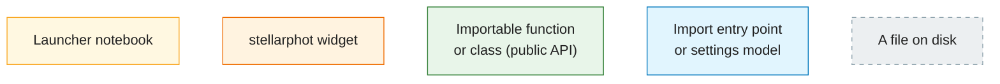
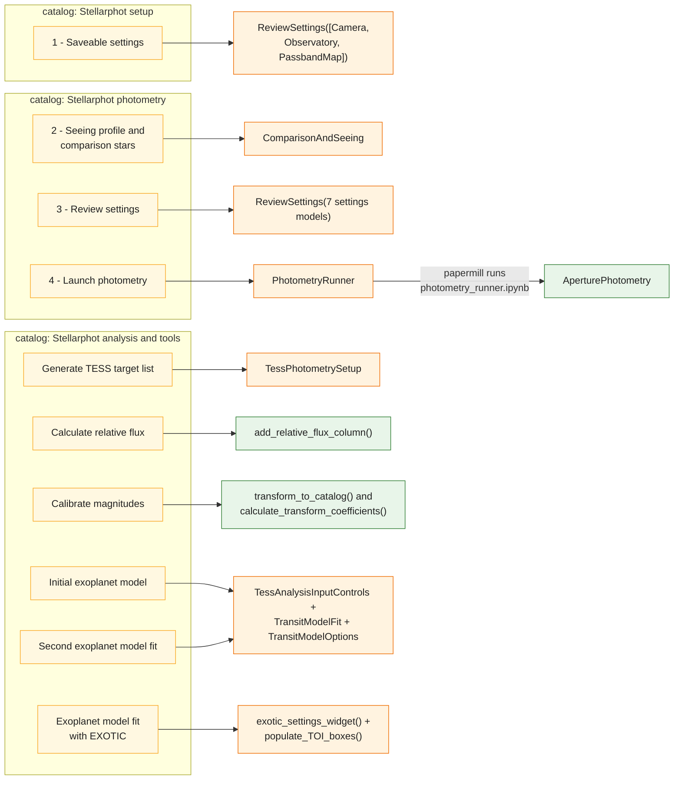
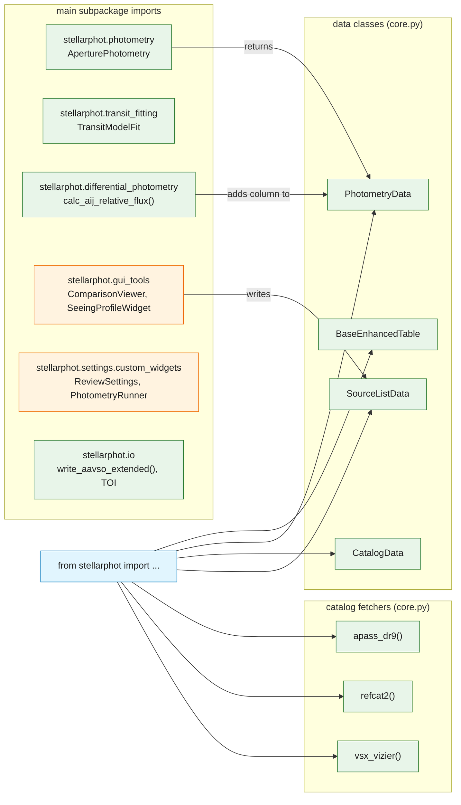
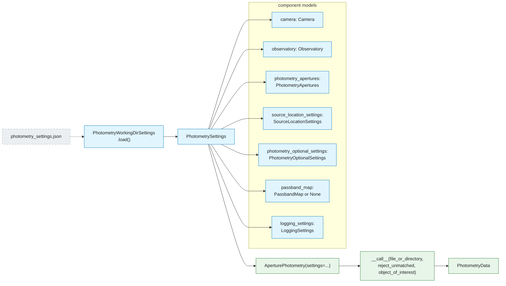

# stellarphot — Entry Points

stellarphot has **no command-line scripts**. There are three ways in:

1. **The Jupyter launcher** — `.jp_app_launcher_stellarphot.yaml` registers ten
   notebooks with `jupyter-app-launcher`, organized into three catalogs.
2. **The public import API** — `from stellarphot import ...` re-exports the
   core data classes and catalog fetchers.
3. **Direct library use** — importing classes such as
   `stellarphot.photometry.AperturePhotometry` or
   `stellarphot.transit_fitting.TransitModelFit` from subpackages.

**Legend** — the node types used on this page:

- **Solid arrows** — opens, instantiates, calls, or returns.
- **Dashed arrows** — loading from or saving to a file.

## Launcher notebooks and the widgets behind them

Each launcher entry opens a notebook whose first cells instantiate one main
widget or function; the diagram shows what each notebook puts on screen.

*Arrows: **solid** = opens / instantiates / calls / returns; **dashed** = loading from or saving to a file.*

What sits behind each widget:

| Launcher entry | Notebook | Main objects used |
|---|---|---|
| 1 - Saveable settings | [`01-initial-settings.ipynb`](../stellarphot/notebooks/01-initial-settings.ipynb) | `ReviewSettings([Camera, Observatory, PassbandMap])` |
| 2 - Seeing profile and comparison stars | [`02-seeing-and-comparison.ipynb`](../stellarphot/notebooks/02-seeing-and-comparison.ipynb) | `ComparisonAndSeeing` (= `SeeingProfileWidget` + `ComparisonViewer`) |
| 3 - Review settings | [`03-final-review-of-settings.ipynb`](../stellarphot/notebooks/03-final-review-of-settings.ipynb) | `ReviewSettings` over all seven `PhotometrySettings` component models |
| 4 - Launch photometry | [`04-launch-photometry.ipynb`](../stellarphot/notebooks/04-launch-photometry.ipynb) | `PhotometryRunner` → papermill → `AperturePhotometry` |
| Generate TESS target list | [`tess-target-source-list-generator.ipynb`](../stellarphot/notebooks/tess-target-source-list-generator.ipynb) | `TessPhotometrySetup` → `tess_photometry_setup()` |
| Calculate relative flux | [`relative-flux-calculation.ipynb`](../stellarphot/notebooks/relative-flux-calculation.ipynb) | `add_relative_flux_column()`, `FitsOpener`, `Spinner` |
| Calibrate magnitudes | [`transform-to-appas-dr9.ipynb`](../stellarphot/notebooks/transform-to-appas-dr9.ipynb) | `transform_to_catalog()`, `vsx_vizier()`, `PhotometryData` |
| Initial / Second exoplanet model | [`tess-initial-model-fit.ipynb`](../stellarphot/notebooks/tess-initial-model-fit.ipynb), [`tess-second-model-fit.ipynb`](../stellarphot/notebooks/tess-second-model-fit.ipynb) | `TessAnalysisInputControls`, `filter_by_dates()`, `TransitModelFit`, `TransitModelOptions`, `TOI`, `plot_transit_lightcurve()` |
| Exoplanet model fit with EXOTIC | [`tess-EXOTIC-fit.ipynb`](../stellarphot/notebooks/tess-EXOTIC-fit.ipynb) | `exotic_settings_widget()`, `populate_TOI_boxes()`, `get_values_from_widget()`, `generate_json_file_name()` |

## Public import API

*Arrows: **solid** = opens / instantiates / calls / returns; **dashed** = loading from or saving to a file.*

*Source: [__init__.py](../stellarphot/__init__.py) (the re-exports), [core.py](../stellarphot/core.py) (the data classes and catalog fetchers).*

## The main programmatic entry point: `AperturePhotometry`

`AperturePhotometry` is configured by a single `PhotometrySettings` object,
usually loaded from `photometry_settings.json` via
`PhotometryWorkingDirSettings`.

*Arrows: **solid** = opens / instantiates / calls / returns; **dashed** = loading from or saving to a file.*

*Source: [photometry.py](../stellarphot/photometry/photometry.py), [models.py](../stellarphot/settings/models.py), [settings_files.py](../stellarphot/settings/settings_files.py), [core.py](../stellarphot/core.py).*

### `AperturePhotometry.__call__` arguments

| Argument | Type / default | Meaning |
|---|---|---|
| `file_or_directory` | `str \| Path` (required) | A single FITS file → `single_image_photometry()`; a directory → `multi_image_photometry()` over every matching image |
| `logline` | `str`, `"single_image_photometry:"` | Prefix for log messages (single-image only) |
| `reject_unmatched` | `bool`, `True` | Drop sources not detected on every image (multi-image only) |
| `object_of_interest` | `str`, `None` | Only process files whose `OBJECT` header matches (multi-image only) |

### Settings model fields (what the JSON file / widgets configure)

| Model | Fields |
|---|---|
| `Camera` | `name`, `data_unit`, `gain`, `read_noise`, `dark_current`, `pixel_scale`, `max_data_value` |
| `Observatory` | `name`, `latitude`, `longitude`, `elevation`, `AAVSO_code`, `TESS_telescope_code` |
| `PhotometryApertures` | `variable_aperture`, `radius`, `gap`, `annulus_width`, `fwhm_estimate` |
| `SourceLocationSettings` | `source_list_file`, `use_coordinates` (`"sky"` or `"pixel"`), `shift_tolerance` |
| `PhotometryOptionalSettings` | `include_dig_noise`, `reject_too_close`, `reject_background_outliers`, `fwhm_method` (`fit`/`profile`/`moments`), `partial_pixel_method` (`exact`/`center`/`subpixel`) |
| `PassbandMap` | `name`, `your_filter_names_to_aavso` (list of `PassbandMapEntry`: instrument filter → AAVSO filter) |
| `LoggingSettings` | `logfile`, `console_log` |
| `PhotometryRunSettings` | `directory_with_images`, `photometry_settings_file`, `reject_unmatched`, `object_of_interest` (parameters papermill passes to `photometry_runner.ipynb`) |

## Other notable callable entry points

| Entry point | Module | Key arguments | What's behind it |
|---|---|---|---|
| `source_detection()` | `stellarphot.photometry` | `ccd`, `fwhm`, `sigma`, `iters`, `threshold`, `find_fwhm` | `DAOStarFinder` + `compute_fwhm()` → returns `SourceListData` |
| `calc_aij_relative_flux()` | `stellarphot.differential_photometry` | `star_data`, `comp_stars`, `in_place`, `coord_column`, `star_id_column` | AIJ-style comparison-star ensemble flux |
| `TransitModelFit.setup_model()` / `.fit()` | `stellarphot.transit_fitting` | `t0`, `depth`, `duration`, `period`, `inclination`, plus airmass/width/sky detrending | batman transit model + `VariableArgsFitter` (scipy leastsq) |
| `transform_to_catalog()` | `stellarphot.utils` | photometry table, passband options, fit order | Cross-match to APASS DR9 / RefCat2 and fit `calibrated_from_instrumental()` |
| `write_aavso_extended()` | `stellarphot.io` | photometry table, destination path, header info | Formats and writes an AAVSO extended-format submission file |
| `tess_photometry_setup()` | `stellarphot.io` | `tic_id` or `TOI_object`, `overwrite` | Queries MAST/ExoFOP, writes `TIC-<id>-info.json` and `TIC-<id>-source-list-input.ecsv` |
| `apass_dr9()`, `refcat2()`, `vsx_vizier()` | `stellarphot` | a WCS or `SkyCoord` (+ search radius) | Vizier/XMatch query → `CatalogData` |
