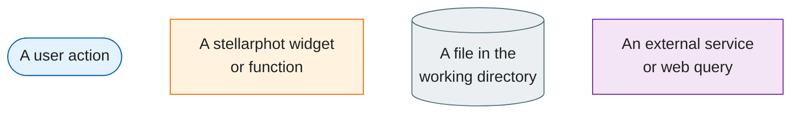
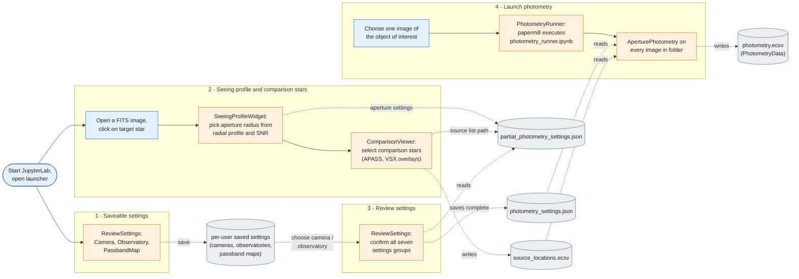
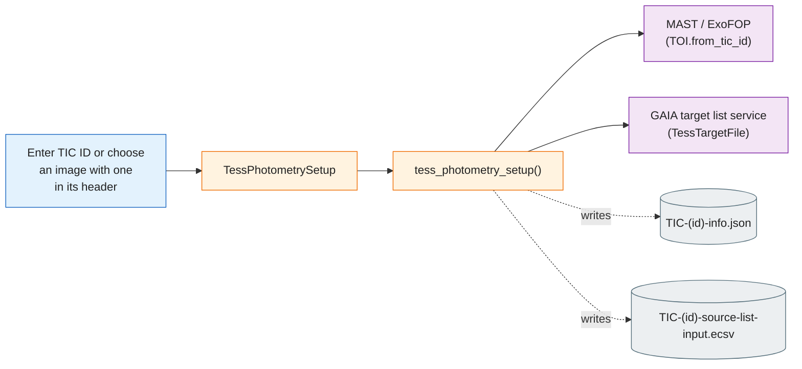
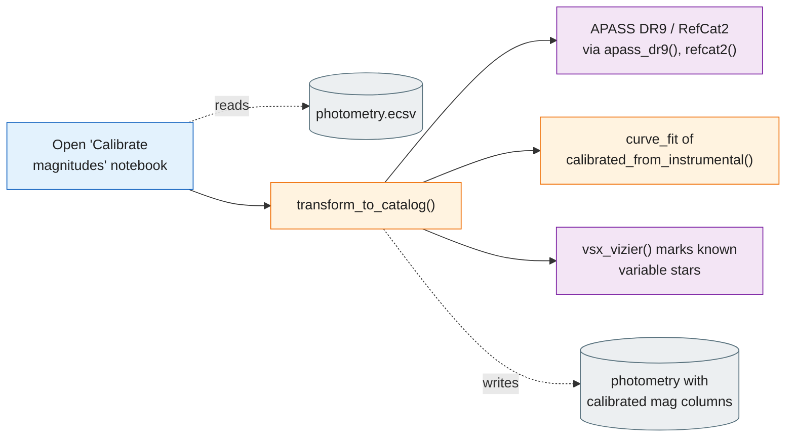

# stellarphot — Example User Flows

These flowcharts show how a typical user moves through stellarphot, from
configuring their equipment to submitting results.

**Legend** — the node types used on this page:

- **Solid arrows** — progression from one step to the next.
- **Dashed arrows** — file reads and writes.

## Flow 1 — Main photometry workflow (launcher notebooks 1 → 4)

A first-time user configures their camera and observatory once (saved
per-user), then for each night of images: inspects a star's seeing profile to
pick apertures, selects comparison stars, reviews the combined settings, and
runs photometry on the whole folder.

*Arrows: **solid** = progression from one step to the next; **dashed** = file reads and writes.*

*Source: [seeing_profile_functions.py](../stellarphot/gui/seeing_profile_functions.py), [comparison_functions.py](../stellarphot/gui/comparison_functions.py), [custom_widgets.py](../stellarphot/gui/custom_widgets.py), [photometry.py](../stellarphot/photometry/photometry.py)*

## Flow 2 — Exoplanet transit analysis

Starting from the photometry table produced by Flow 1, the user computes
relative fluxes, then fits transit models of increasing sophistication and
prepares submission files.

*Arrows: **solid** = progression from one step to the next; **dashed** = file reads and writes.*

```mermaid
flowchart LR
    classDef action fill:#e3f2fd,stroke:#1565c0,color:#212121
    classDef widget fill:#fff3e0,stroke:#ef6c00,color:#212121
    classDef artifact fill:#eceff1,stroke:#546e7a,color:#212121

    photecsv[("photometry.ecsv")]:::artifact

    subgraph sg_flux["Calculate relative flux"]
        direction TB
        w_flux["add_relative_flux_column():<br/>ensemble of comparison stars"]:::widget
    end

    relflux[("photometry-relative-flux.ecsv")]:::artifact
    ticinfo[("TIC-(id)-info.json")]:::artifact

    subgraph sg_fit1["Initial exoplanet model"]
        direction TB
        w_inputs1["TessAnalysisInputControls:<br/>choose photometry file,<br/>TIC info, passband"]:::widget
        w_fit1["TransitModelFit.setup_model()<br/>then .fit()"]:::widget
        w_plot1["plot_transit_lightcurve()"]:::widget
    end

    subgraph sg_fit2["Second exoplanet model fit"]
        direction TB
        w_fit2["TransitModelFit with<br/>detrending (airmass,<br/>width, sky) via<br/>TransitModelOptions"]:::widget
    end

    subgraph sg_exotic["Exoplanet model fit with EXOTIC"]
        direction TB
        w_exotic["exotic_settings_widget()<br/>populate_TOI_boxes()"]:::widget
        a_exotic["Run EXOTIC with<br/>generated settings"]:::action
    end

    exoticjson[("EXOTIC settings .json")]:::artifact
    aavso["PhotometryData<br/>.write_aavso_extended()"]:::widget
    aavsofile[("AAVSO extended<br/>format file")]:::artifact

    photecsv -.-> w_flux
    w_flux -.->|"writes"| relflux
    relflux -.-> w_inputs1
    ticinfo -.-> w_inputs1
    w_inputs1 --> w_fit1
    w_fit1 --> w_plot1
    w_plot1 --> w_fit2
    w_fit2 --> w_exotic
    w_exotic -.->|"writes"| exoticjson
    exoticjson -.-> a_exotic
    relflux -.-> aavso
    aavso -.->|"writes"| aavsofile

    click w_flux href "../stellarphot/differential_photometry/aij_rel_fluxes.py" "aij_rel_fluxes.py"
    click w_inputs1 href "../stellarphot/gui/photometry_widget_functions.py" "photometry_widget_functions.py"
    click w_fit1 href "../stellarphot/transit_fitting/core.py" "transit_fitting/core.py"
    click w_plot1 href "../stellarphot/plotting/transit_plots.py" "transit_plots.py"
    click w_fit2 href "../stellarphot/transit_fitting/core.py" "transit_fitting/core.py"
    click w_exotic href "../stellarphot/gui/transit_fitting_gui.py" "gui/transit_fitting_gui.py"
    click aavso href "../stellarphot/core.py" "core.py"
```

*Source: [aij_rel_fluxes.py](../stellarphot/differential_photometry/aij_rel_fluxes.py), [photometry_widget_functions.py](../stellarphot/gui/photometry_widget_functions.py), [transit_fitting/core.py](../stellarphot/transit_fitting/core.py), [transit_plots.py](../stellarphot/plotting/transit_plots.py), [gui/transit_fitting_gui.py](../stellarphot/gui/transit_fitting_gui.py)*

## Flow 3 — Supporting flows

### Generate a TESS target source list

Run before Flow 1 when observing a TESS Object of Interest: it fetches the
transit parameters and nearby GAIA sources so the photometry includes the
stars TFOP wants checked.

*Arrows: **solid** = progression from one step to the next; **dashed** = file reads and writes.*

*Source: [custom_widgets.py](../stellarphot/gui/custom_widgets.py), [io/tess.py](../stellarphot/io/tess.py)*

### Calibrate magnitudes to a catalog (APASS DR9)

Run after Flow 1 for variable-star work: instrumental magnitudes are
transformed onto the catalog system, night by night.

*Arrows: **solid** = progression from one step to the next; **dashed** = file reads and writes.*

*Source: [magnitude_transforms.py](../stellarphot/utils/magnitude_transforms.py)*
