# stellarphot — Per-File Call Graphs

This page shows, for each file (or small group of tightly coupled files), the
functions and classes it contains and how they call each other.

**Legend** — the node types used in every diagram on this page:

```mermaid
flowchart LR
    classDef cls fill:#e1f5fe,stroke:#0277bd,color:#212121
    classDef fn fill:#e8f5e9,stroke:#2e7d32,color:#212121
    classDef external fill:#eceff1,stroke:#90a4ae,stroke-dasharray: 5 5,color:#212121

    a_class["A class or method<br/>defined in the file"]:::cls
    a_func["A module-level function<br/>defined in the file"]:::fn
    a_ext["Code outside the file(s)<br/>in this diagram"]:::external

    a_class ~~~ a_func ~~~ a_ext
```

- **Solid arrows** — a direct call or instantiation.
- **Dashed arrows** — file or network I/O, or an optional path.

## [core.py](../stellarphot/core.py) — data classes — and [catalogs.py](../stellarphot/catalogs.py) — catalog fetchers

`BaseEnhancedTable` is a validated `astropy.table.QTable`; the three public
table classes inherit from it. The catalog fetcher functions live in
`catalogs.py` and all funnel through `CatalogData.from_vizier()`.

*Arrows: **solid** = a direct call or instantiation; **dashed** = file or network I/O, or an optional path.*

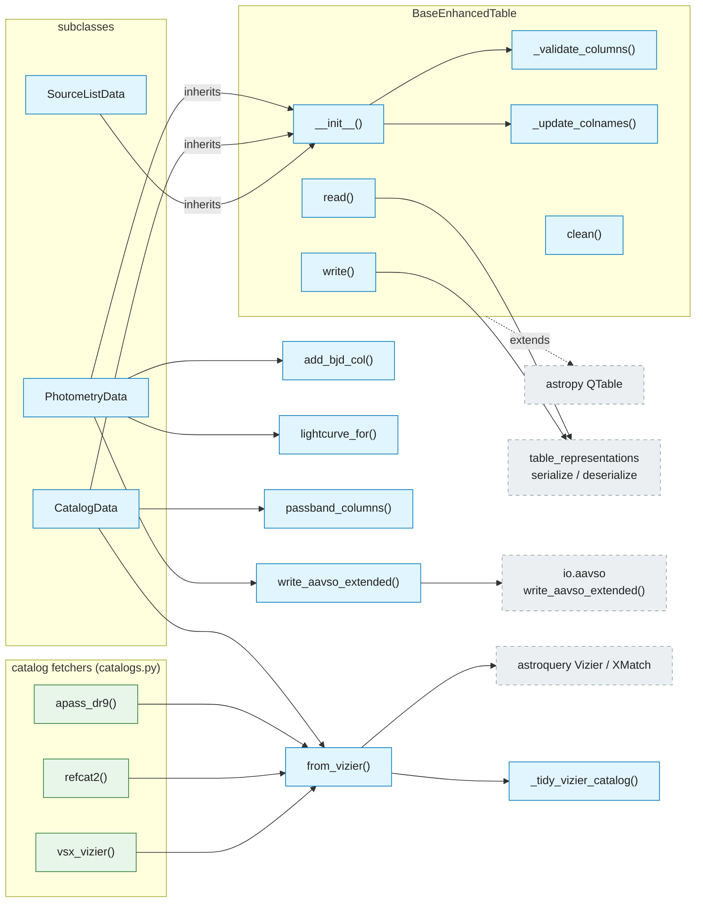
```mermaid
flowchart LR
    classDef cls fill:#e1f5fe,stroke:#0277bd,color:#212121
    classDef fn fill:#e8f5e9,stroke:#2e7d32,color:#212121
    classDef external fill:#eceff1,stroke:#90a4ae,stroke-dasharray: 5 5,color:#212121

    qtable["astropy QTable"]:::external

    subgraph sg_base["BaseEnhancedTable"]
        direction TB
        bet_init["__init__()"]:::cls
        bet_validate["_validate_columns()"]:::cls
        bet_colnames["_update_colnames()"]:::cls
        bet_read["read()"]:::cls
        bet_write["write()"]:::cls
        bet_clean["clean()"]:::cls
    end

    subgraph sg_subclasses["subclasses"]
        direction TB
        pd_cls["PhotometryData"]:::cls
        cd_cls["CatalogData"]:::cls
        sld_cls["SourceListData"]:::cls
    end

    subgraph sg_catalogs["catalog fetchers (catalogs.py)"]
        direction TB
        apass_fn["apass_dr9()"]:::fn
        refcat_fn["refcat2()"]:::fn
        vsx_fn["vsx_vizier()"]:::fn
    end

    trep_ser["table_representations<br/>serialize / deserialize"]:::external
    aavso_ext["io.aavso<br/>write_aavso_extended()"]:::external
    vizier_ext["astroquery Vizier / XMatch"]:::external

    sg_base -.->|"extends"| qtable
    pd_cls -->|"inherits"| bet_init
    cd_cls -->|"inherits"| bet_init
    sld_cls -->|"inherits"| bet_init

    bet_init --> bet_validate
    bet_init --> bet_colnames
    bet_read --> trep_ser
    bet_write --> trep_ser

    pd_cls --> pd_bjd["add_bjd_col()"]:::cls
    pd_cls --> pd_lc["lightcurve_for()"]:::cls
    pd_cls --> pd_aavso["write_aavso_extended()"]:::cls
    pd_aavso --> aavso_ext

    cd_cls --> cd_viz["from_vizier()"]:::cls
    cd_cls --> cd_pass["passband_columns()"]:::cls
    cd_viz --> cd_tidy["_tidy_vizier_catalog()"]:::cls
    cd_viz --> vizier_ext

    apass_fn --> cd_viz
    refcat_fn --> cd_viz
    vsx_fn --> cd_viz

    click bet_init href "../stellarphot/core.py" "core.py"
    click bet_validate href "../stellarphot/core.py" "core.py"
    click bet_colnames href "../stellarphot/core.py" "core.py"
    click bet_read href "../stellarphot/core.py" "core.py"
    click bet_write href "../stellarphot/core.py" "core.py"
    click bet_clean href "../stellarphot/core.py" "core.py"
    click pd_cls href "../stellarphot/core.py" "core.py"
    click cd_cls href "../stellarphot/core.py" "core.py"
    click sld_cls href "../stellarphot/core.py" "core.py"
    click apass_fn href "../stellarphot/catalogs.py" "catalogs.py"
    click refcat_fn href "../stellarphot/catalogs.py" "catalogs.py"
    click vsx_fn href "../stellarphot/catalogs.py" "catalogs.py"
    click pd_bjd href "../stellarphot/core.py" "core.py"
    click pd_lc href "../stellarphot/core.py" "core.py"
    click pd_aavso href "../stellarphot/core.py" "core.py"
    click cd_viz href "../stellarphot/core.py" "core.py"
    click cd_pass href "../stellarphot/core.py" "core.py"
    click cd_tidy href "../stellarphot/core.py" "core.py"
    click trep_ser href "../stellarphot/table_representations.py" "table_representations.py"
    click aavso_ext href "../stellarphot/io/aavso.py" "io/aavso.py"
```

## [photometry/photometry.py](../stellarphot/photometry/photometry.py) — the aperture photometry pipeline

*Arrows: **solid** = a direct call or instantiation; **dashed** = file or network I/O, or an optional path.*

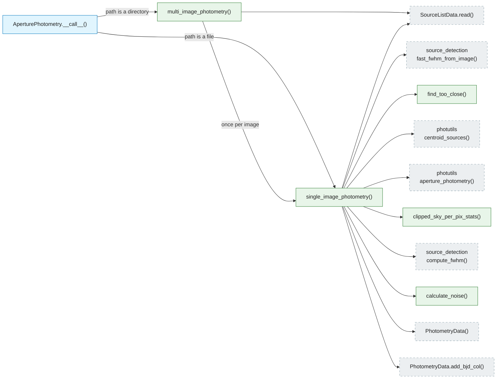
```mermaid
flowchart LR
    classDef cls fill:#e1f5fe,stroke:#0277bd,color:#212121
    classDef fn fill:#e8f5e9,stroke:#2e7d32,color:#212121
    classDef external fill:#eceff1,stroke:#90a4ae,stroke-dasharray: 5 5,color:#212121

    ap_call["AperturePhotometry.__call__()"]:::cls

    multi["multi_image_photometry()"]:::fn
    single["single_image_photometry()"]:::fn
    findclose["find_too_close()"]:::fn
    skystats["clipped_sky_per_pix_stats()"]:::fn
    noise["calculate_noise()"]:::fn

    fastfwhm["source_detection<br/>fast_fwhm_from_image()"]:::external
    fwhm["source_detection<br/>compute_fwhm()"]:::external
    sld_read["SourceListData.read()"]:::external
    centroid["photutils<br/>centroid_sources()"]:::external
    apphot["photutils<br/>aperture_photometry()"]:::external
    pdata["PhotometryData()"]:::external
    bjd["PhotometryData.add_bjd_col()"]:::external

    ap_call -->|"path is a directory"| multi
    ap_call -->|"path is a file"| single
    multi -->|"once per image"| single
    multi --> sld_read

    single --> sld_read
    single --> fastfwhm
    single --> findclose
    single --> centroid
    single --> apphot
    single --> skystats
    single --> fwhm
    single --> noise
    single --> pdata
    single --> bjd

    click ap_call href "../stellarphot/photometry/photometry.py" "photometry.py"
    click multi href "../stellarphot/photometry/photometry.py" "photometry.py"
    click single href "../stellarphot/photometry/photometry.py" "photometry.py"
    click findclose href "../stellarphot/photometry/photometry.py" "photometry.py"
    click skystats href "../stellarphot/photometry/photometry.py" "photometry.py"
    click noise href "../stellarphot/photometry/photometry.py" "photometry.py"
    click fastfwhm href "../stellarphot/photometry/source_detection.py" "source_detection.py"
    click fwhm href "../stellarphot/photometry/source_detection.py" "source_detection.py"
    click sld_read href "../stellarphot/core.py" "core.py"
    click pdata href "../stellarphot/core.py" "core.py"
    click bjd href "../stellarphot/core.py" "core.py"
```

## [photometry/source_detection.py](../stellarphot/photometry/source_detection.py) + [photometry/profiles.py](../stellarphot/photometry/profiles.py)

*Arrows: **solid** = a direct call or instantiation; **dashed** = file or network I/O, or an optional path.*

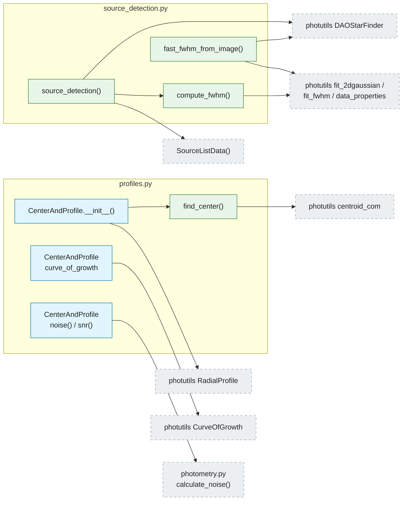
```mermaid
flowchart LR
    classDef cls fill:#e1f5fe,stroke:#0277bd,color:#212121
    classDef fn fill:#e8f5e9,stroke:#2e7d32,color:#212121
    classDef external fill:#eceff1,stroke:#90a4ae,stroke-dasharray: 5 5,color:#212121

    subgraph sg_srcdet["source_detection.py"]
        direction TB
        srcdet["source_detection()"]:::fn
        fwhm["compute_fwhm()"]:::fn
        fastfwhm["fast_fwhm_from_image()"]:::fn
    end

    subgraph sg_prof["profiles.py"]
        direction TB
        findcenter["find_center()"]:::fn
        cap_init["CenterAndProfile.__init__()"]:::cls
        cap_cog["CenterAndProfile<br/>curve_of_growth"]:::cls
        cap_noise["CenterAndProfile<br/>noise() / snr()"]:::cls
    end

    dao["photutils DAOStarFinder"]:::external
    fitters["photutils fit_2dgaussian /<br/>fit_fwhm / data_properties"]:::external
    radprof["photutils RadialProfile"]:::external
    cog["photutils CurveOfGrowth"]:::external
    centroids["photutils centroid_com"]:::external
    sld["SourceListData()"]:::external
    calcnoise["photometry.py<br/>calculate_noise()"]:::external

    srcdet --> dao
    srcdet --> fwhm
    srcdet --> sld
    fwhm --> fitters
    fastfwhm --> dao
    fastfwhm --> fitters

    findcenter --> centroids
    cap_init --> findcenter
    cap_init --> radprof
    cap_cog --> cog
    cap_noise --> calcnoise

    click srcdet href "../stellarphot/photometry/source_detection.py" "source_detection.py"
    click fwhm href "../stellarphot/photometry/source_detection.py" "source_detection.py"
    click fastfwhm href "../stellarphot/photometry/source_detection.py" "source_detection.py"
    click findcenter href "../stellarphot/photometry/profiles.py" "profiles.py"
    click cap_init href "../stellarphot/photometry/profiles.py" "profiles.py"
    click cap_cog href "../stellarphot/photometry/profiles.py" "profiles.py"
    click cap_noise href "../stellarphot/photometry/profiles.py" "profiles.py"
    click sld href "../stellarphot/core.py" "core.py"
    click calcnoise href "../stellarphot/photometry/photometry.py" "photometry.py"
```

## [settings/models.py](../stellarphot/settings/models.py) + [settings/astropy_pydantic.py](../stellarphot/settings/astropy_pydantic.py)

`PhotometrySettings` is a pure composition of the other models; the arrows
below mean "has a field of this type". All models inherit from
`BaseModelWithTableRep`, which registers YAML representers so settings can be
embedded in table metadata.

*Arrows: **solid** = a direct call or instantiation; **dashed** = file or network I/O, or an optional path.*

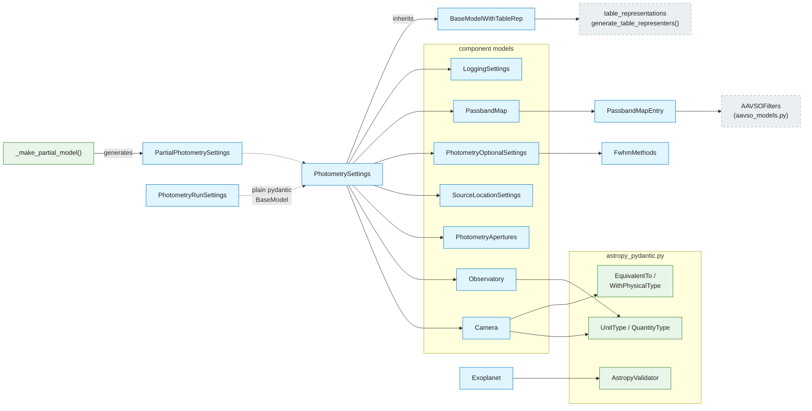
```mermaid
flowchart LR
    classDef cls fill:#e1f5fe,stroke:#0277bd,color:#212121
    classDef fn fill:#e8f5e9,stroke:#2e7d32,color:#212121
    classDef external fill:#eceff1,stroke:#90a4ae,stroke-dasharray: 5 5,color:#212121

    ps["PhotometrySettings"]:::cls

    subgraph sg_components["component models"]
        direction TB
        cam["Camera"]:::cls
        obs["Observatory"]:::cls
        apert["PhotometryApertures"]:::cls
        srcloc["SourceLocationSettings"]:::cls
        opt["PhotometryOptionalSettings"]:::cls
        pbm["PassbandMap"]:::cls
        logset["LoggingSettings"]:::cls
    end

    pbe["PassbandMapEntry"]:::cls
    aavsof["AAVSOFilters<br/>(aavso_models.py)"]:::external
    fwhmm["FwhmMethods"]:::cls

    subgraph sg_apydantic["astropy_pydantic.py"]
        direction TB
        qty["UnitType / QuantityType"]:::fn
        equiv["EquivalentTo /<br/>WithPhysicalType"]:::fn
        astroval["AstropyValidator"]:::fn
    end

    basemodel["BaseModelWithTableRep"]:::cls
    tabrep["table_representations<br/>generate_table_representers()"]:::external
    partial_fn["_make_partial_model()"]:::fn
    partialps["PartialPhotometrySettings"]:::cls
    exo["Exoplanet"]:::cls
    runset["PhotometryRunSettings"]:::cls

    ps --> cam
    ps --> obs
    ps --> apert
    ps --> srcloc
    ps --> opt
    ps --> pbm
    ps --> logset

    pbm --> pbe
    pbe --> aavsof
    opt --> fwhmm

    cam --> qty
    cam --> equiv
    obs --> qty
    exo --> astroval

    basemodel --> tabrep
    ps -->|"inherits"| basemodel
    partial_fn -->|"generates"| partialps
    partialps -.-> ps
    runset -.->|"plain pydantic<br/>BaseModel"| ps

    click ps href "../stellarphot/settings/models.py" "models.py"
    click cam href "../stellarphot/settings/models.py" "models.py"
    click obs href "../stellarphot/settings/models.py" "models.py"
    click apert href "../stellarphot/settings/models.py" "models.py"
    click srcloc href "../stellarphot/settings/models.py" "models.py"
    click opt href "../stellarphot/settings/models.py" "models.py"
    click pbm href "../stellarphot/settings/models.py" "models.py"
    click logset href "../stellarphot/settings/models.py" "models.py"
    click pbe href "../stellarphot/settings/models.py" "models.py"
    click fwhmm href "../stellarphot/settings/models.py" "models.py"
    click basemodel href "../stellarphot/settings/models.py" "models.py"
    click partial_fn href "../stellarphot/settings/models.py" "models.py"
    click partialps href "../stellarphot/settings/models.py" "models.py"
    click exo href "../stellarphot/settings/models.py" "models.py"
    click runset href "../stellarphot/settings/models.py" "models.py"
    click aavsof href "../stellarphot/settings/aavso_models.py" "aavso_models.py"
    click qty href "../stellarphot/settings/astropy_pydantic.py" "astropy_pydantic.py"
    click equiv href "../stellarphot/settings/astropy_pydantic.py" "astropy_pydantic.py"
    click astroval href "../stellarphot/settings/astropy_pydantic.py" "astropy_pydantic.py"
    click tabrep href "../stellarphot/table_representations.py" "table_representations.py"
```

## [gui/custom_widgets.py](../stellarphot/gui/custom_widgets.py) — widget layer

*Arrows: **solid** = a direct call or instantiation; **dashed** = file or network I/O, or an optional path.*

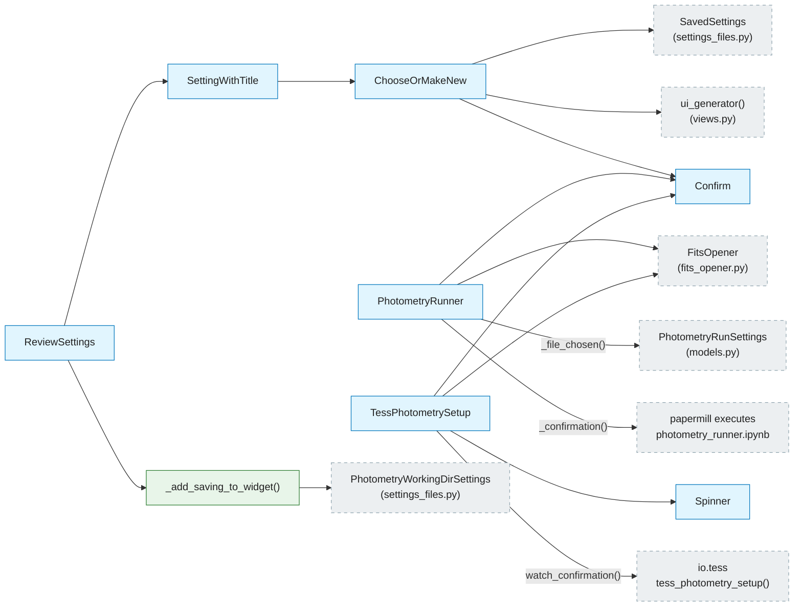
```mermaid
flowchart LR
    classDef cls fill:#e1f5fe,stroke:#0277bd,color:#212121
    classDef fn fill:#e8f5e9,stroke:#2e7d32,color:#212121
    classDef external fill:#eceff1,stroke:#90a4ae,stroke-dasharray: 5 5,color:#212121

    review["ReviewSettings"]:::cls
    swt["SettingWithTitle"]:::cls
    cmn["ChooseOrMakeNew"]:::cls
    confirm["Confirm"]:::cls
    addsave["_add_saving_to_widget()"]:::fn
    runner["PhotometryRunner"]:::cls
    tps["TessPhotometrySetup"]:::cls
    spinner["Spinner"]:::cls

    saved["SavedSettings<br/>(settings_files.py)"]:::external
    pwds["PhotometryWorkingDirSettings<br/>(settings_files.py)"]:::external
    uigen["ui_generator()<br/>(views.py)"]:::external
    fo["FitsOpener<br/>(fits_opener.py)"]:::external
    tpsetup["io.tess<br/>tess_photometry_setup()"]:::external
    runsettings["PhotometryRunSettings<br/>(models.py)"]:::external
    papermill["papermill executes<br/>photometry_runner.ipynb"]:::external

    review --> swt
    review --> addsave
    addsave --> pwds
    swt --> cmn
    cmn --> saved
    cmn --> uigen
    cmn --> confirm

    runner --> fo
    runner --> confirm
    runner -->|"_file_chosen()"| runsettings
    runner -->|"_confirmation()"| papermill

    tps --> fo
    tps --> confirm
    tps --> spinner
    tps -->|"watch_confirmation()"| tpsetup

    click review href "../stellarphot/gui/custom_widgets.py" "custom_widgets.py"
    click swt href "../stellarphot/gui/custom_widgets.py" "custom_widgets.py"
    click cmn href "../stellarphot/gui/custom_widgets.py" "custom_widgets.py"
    click confirm href "../stellarphot/gui/custom_widgets.py" "custom_widgets.py"
    click addsave href "../stellarphot/gui/custom_widgets.py" "custom_widgets.py"
    click runner href "../stellarphot/gui/custom_widgets.py" "custom_widgets.py"
    click tps href "../stellarphot/gui/custom_widgets.py" "custom_widgets.py"
    click spinner href "../stellarphot/gui/custom_widgets.py" "custom_widgets.py"
    click saved href "../stellarphot/settings/settings_files.py" "settings_files.py"
    click pwds href "../stellarphot/settings/settings_files.py" "settings_files.py"
    click uigen href "../stellarphot/gui/views.py" "views.py"
    click fo href "../stellarphot/gui/fits_opener.py" "fits_opener.py"
    click tpsetup href "../stellarphot/io/tess.py" "io/tess.py"
    click runsettings href "../stellarphot/settings/models.py" "models.py"
    click papermill href "../stellarphot/notebooks/photometry_runner.ipynb" "photometry_runner.ipynb"
```

## [settings/settings_files.py](../stellarphot/settings/settings_files.py) + [gui/fits_opener.py](../stellarphot/gui/fits_opener.py)

*Arrows: **solid** = a direct call or instantiation; **dashed** = file or network I/O, or an optional path.*

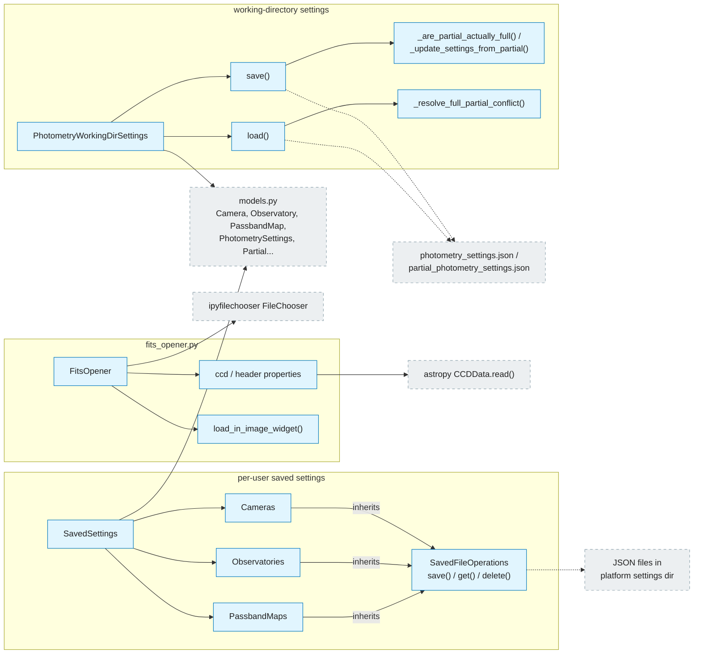
```mermaid
flowchart LR
    classDef cls fill:#e1f5fe,stroke:#0277bd,color:#212121
    classDef fn fill:#e8f5e9,stroke:#2e7d32,color:#212121
    classDef external fill:#eceff1,stroke:#90a4ae,stroke-dasharray: 5 5,color:#212121

    subgraph sg_saved["per-user saved settings"]
        direction TB
        saved["SavedSettings"]:::cls
        sfo["SavedFileOperations<br/>save() / get() / delete()"]:::cls
        cams["Cameras"]:::cls
        obss["Observatories"]:::cls
        pbms["PassbandMaps"]:::cls
    end

    subgraph sg_wd["working-directory settings"]
        direction TB
        pwds["PhotometryWorkingDirSettings"]:::cls
        pwds_save["save()"]:::cls
        pwds_load["load()"]:::cls
        pwds_partial["_are_partial_actually_full() /<br/>_update_settings_from_partial()"]:::cls
        pwds_conflict["_resolve_full_partial_conflict()"]:::cls
    end

    subgraph sg_fo["fits_opener.py"]
        direction TB
        fo["FitsOpener"]:::cls
        fo_ccd["ccd / header properties"]:::cls
        fo_load["load_in_image_widget()"]:::cls
    end

    models["models.py<br/>Camera, Observatory, PassbandMap,<br/>PhotometrySettings, Partial..."]:::external
    userdir["JSON files in<br/>platform settings dir"]:::external
    wdjson["photometry_settings.json /<br/>partial_photometry_settings.json"]:::external
    filechooser["ipyfilechooser FileChooser"]:::external
    ccddata["astropy CCDData.read()"]:::external

    cams -->|"inherits"| sfo
    obss -->|"inherits"| sfo
    pbms -->|"inherits"| sfo
    saved --> cams
    saved --> obss
    saved --> pbms
    saved --> models
    sfo -.-> userdir

    pwds --> pwds_save
    pwds --> pwds_load
    pwds_save --> pwds_partial
    pwds_load --> pwds_conflict
    pwds --> models
    pwds_save -.-> wdjson
    pwds_load -.-> wdjson

    fo --> filechooser
    fo_ccd --> ccddata
    fo --> fo_ccd
    fo --> fo_load

    click saved href "../stellarphot/settings/settings_files.py" "settings_files.py"
    click sfo href "../stellarphot/settings/settings_files.py" "settings_files.py"
    click cams href "../stellarphot/settings/settings_files.py" "settings_files.py"
    click obss href "../stellarphot/settings/settings_files.py" "settings_files.py"
    click pbms href "../stellarphot/settings/settings_files.py" "settings_files.py"
    click pwds href "../stellarphot/settings/settings_files.py" "settings_files.py"
    click pwds_save href "../stellarphot/settings/settings_files.py" "settings_files.py"
    click pwds_load href "../stellarphot/settings/settings_files.py" "settings_files.py"
    click pwds_partial href "../stellarphot/settings/settings_files.py" "settings_files.py"
    click pwds_conflict href "../stellarphot/settings/settings_files.py" "settings_files.py"
    click fo href "../stellarphot/gui/fits_opener.py" "fits_opener.py"
    click fo_ccd href "../stellarphot/gui/fits_opener.py" "fits_opener.py"
    click fo_load href "../stellarphot/gui/fits_opener.py" "fits_opener.py"
    click models href "../stellarphot/settings/models.py" "models.py"
```

## [io/aij.py](../stellarphot/io/aij.py) + [io/aavso.py](../stellarphot/io/aavso.py)

*Arrows: **solid** = a direct call or instantiation; **dashed** = file or network I/O, or an optional path.*

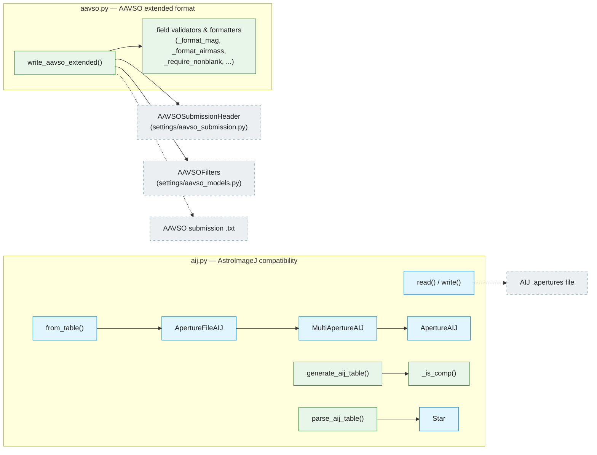
```mermaid
flowchart LR
    classDef cls fill:#e1f5fe,stroke:#0277bd,color:#212121
    classDef fn fill:#e8f5e9,stroke:#2e7d32,color:#212121
    classDef external fill:#eceff1,stroke:#90a4ae,stroke-dasharray: 5 5,color:#212121

    subgraph sg_aij["aij.py — AstroImageJ compatibility"]
        direction TB
        afa["ApertureFileAIJ"]:::cls
        afa_from["from_table()"]:::cls
        afa_rw["read() / write()"]:::cls
        multiap["MultiApertureAIJ"]:::cls
        apaij["ApertureAIJ"]:::cls
        gen["generate_aij_table()"]:::fn
        parse["parse_aij_table()"]:::fn
        iscomp["_is_comp()"]:::fn
        star["Star"]:::cls
    end

    subgraph sg_aavso["aavso.py — AAVSO extended format"]
        direction TB
        waavso["write_aavso_extended()"]:::fn
        fmt["field validators & formatters<br/>(_format_mag, _format_airmass,<br/>_require_nonblank, ...)"]:::fn
    end

    aavso_hdr["AAVSOSubmissionHeader<br/>(settings/aavso_submission.py)"]:::external
    aavso_filters["AAVSOFilters<br/>(settings/aavso_models.py)"]:::external
    aijfile["AIJ .apertures file"]:::external
    aavsofile["AAVSO submission .txt"]:::external

    afa --> multiap
    multiap --> apaij
    afa_from --> afa
    afa_rw -.-> aijfile
    gen --> iscomp
    parse --> star

    waavso --> fmt
    waavso --> aavso_hdr
    waavso --> aavso_filters
    waavso -.-> aavsofile

    click afa href "../stellarphot/io/aij.py" "io/aij.py"
    click afa_from href "../stellarphot/io/aij.py" "io/aij.py"
    click afa_rw href "../stellarphot/io/aij.py" "io/aij.py"
    click multiap href "../stellarphot/io/aij.py" "io/aij.py"
    click apaij href "../stellarphot/io/aij.py" "io/aij.py"
    click gen href "../stellarphot/io/aij.py" "io/aij.py"
    click parse href "../stellarphot/io/aij.py" "io/aij.py"
    click iscomp href "../stellarphot/io/aij.py" "io/aij.py"
    click star href "../stellarphot/io/aij.py" "io/aij.py"
    click waavso href "../stellarphot/io/aavso.py" "io/aavso.py"
    click fmt href "../stellarphot/io/aavso.py" "io/aavso.py"
    click aavso_hdr href "../stellarphot/settings/aavso_submission.py" "aavso_submission.py"
    click aavso_filters href "../stellarphot/settings/aavso_models.py" "aavso_models.py"
```

## [io/tess.py](../stellarphot/io/tess.py)

*Arrows: **solid** = a direct call or instantiation; **dashed** = file or network I/O, or an optional path.*

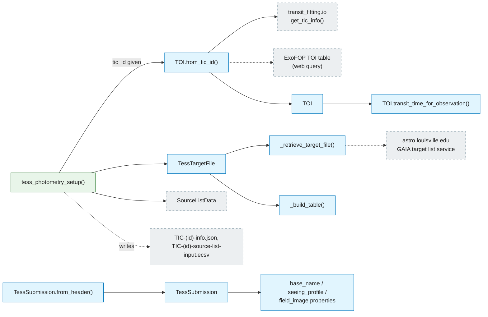
```mermaid
flowchart LR
    classDef cls fill:#e1f5fe,stroke:#0277bd,color:#212121
    classDef fn fill:#e8f5e9,stroke:#2e7d32,color:#212121
    classDef external fill:#eceff1,stroke:#90a4ae,stroke-dasharray: 5 5,color:#212121

    tsetup["tess_photometry_setup()"]:::fn
    toi["TOI"]:::cls
    toi_from["TOI.from_tic_id()"]:::cls
    toi_transit["TOI.transit_time_for_observation()"]:::cls
    ttf["TessTargetFile"]:::cls
    ttf_get["_retrieve_target_file()"]:::cls
    ttf_build["_build_table()"]:::cls
    tsub["TessSubmission"]:::cls
    tsub_from["TessSubmission.from_header()"]:::cls
    tsub_props["base_name / seeing_profile /<br/>field_image properties"]:::cls

    gettic["transit_fitting.io<br/>get_tic_info()"]:::external
    exofop["ExoFOP TOI table<br/>(web query)"]:::external
    gaia_svc["astro.louisville.edu<br/>GAIA target list service"]:::external
    sld["SourceListData"]:::external
    outfiles["TIC-(id)-info.json,<br/>TIC-(id)-source-list-input.ecsv"]:::external

    tsetup -->|"tic_id given"| toi_from
    toi_from --> gettic
    toi_from -.-> exofop
    toi_from --> toi
    toi --> toi_transit
    tsetup --> ttf
    ttf --> ttf_get
    ttf --> ttf_build
    ttf_get -.-> gaia_svc
    tsetup --> sld
    tsetup -.->|"writes"| outfiles

    tsub_from --> tsub
    tsub --> tsub_props

    click tsetup href "../stellarphot/io/tess.py" "io/tess.py"
    click toi href "../stellarphot/io/tess.py" "io/tess.py"
    click toi_from href "../stellarphot/io/tess.py" "io/tess.py"
    click toi_transit href "../stellarphot/io/tess.py" "io/tess.py"
    click ttf href "../stellarphot/io/tess.py" "io/tess.py"
    click ttf_get href "../stellarphot/io/tess.py" "io/tess.py"
    click ttf_build href "../stellarphot/io/tess.py" "io/tess.py"
    click tsub href "../stellarphot/io/tess.py" "io/tess.py"
    click tsub_from href "../stellarphot/io/tess.py" "io/tess.py"
    click tsub_props href "../stellarphot/io/tess.py" "io/tess.py"
    click gettic href "../stellarphot/transit_fitting/io.py" "transit_fitting/io.py"
    click sld href "../stellarphot/core.py" "core.py"
```

## [differential_photometry/](../stellarphot/differential_photometry/)

*Arrows: **solid** = a direct call or instantiation; **dashed** = file or network I/O, or an optional path.*

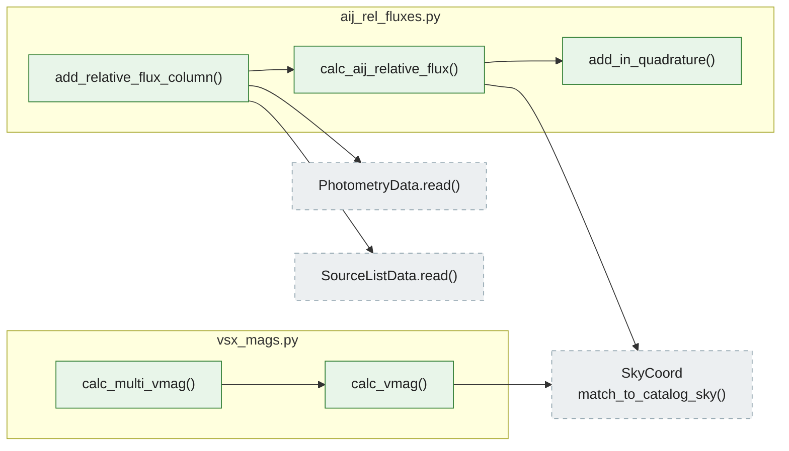
```mermaid
flowchart LR
    classDef fn fill:#e8f5e9,stroke:#2e7d32,color:#212121
    classDef external fill:#eceff1,stroke:#90a4ae,stroke-dasharray: 5 5,color:#212121

    subgraph sg_rel["aij_rel_fluxes.py"]
        direction TB
        addcol["add_relative_flux_column()"]:::fn
        calc["calc_aij_relative_flux()"]:::fn
        quad["add_in_quadrature()"]:::fn
    end

    subgraph sg_vsx["vsx_mags.py"]
        direction TB
        multivmag["calc_multi_vmag()"]:::fn
        vmag["calc_vmag()"]:::fn
    end

    pdread["PhotometryData.read()"]:::external
    sldread["SourceListData.read()"]:::external
    skymatch["SkyCoord<br/>match_to_catalog_sky()"]:::external

    addcol --> pdread
    addcol --> sldread
    addcol --> calc
    calc --> quad
    calc --> skymatch

    multivmag --> vmag
    vmag --> skymatch

    click addcol href "../stellarphot/differential_photometry/aij_rel_fluxes.py" "aij_rel_fluxes.py"
    click calc href "../stellarphot/differential_photometry/aij_rel_fluxes.py" "aij_rel_fluxes.py"
    click quad href "../stellarphot/differential_photometry/aij_rel_fluxes.py" "aij_rel_fluxes.py"
    click multivmag href "../stellarphot/differential_photometry/vsx_mags.py" "vsx_mags.py"
    click vmag href "../stellarphot/differential_photometry/vsx_mags.py" "vsx_mags.py"
    click pdread href "../stellarphot/core.py" "core.py"
    click sldread href "../stellarphot/core.py" "core.py"
```

## [transit_fitting/](../stellarphot/transit_fitting/)

*Arrows: **solid** = a direct call or instantiation; **dashed** = file or network I/O, or an optional path.*

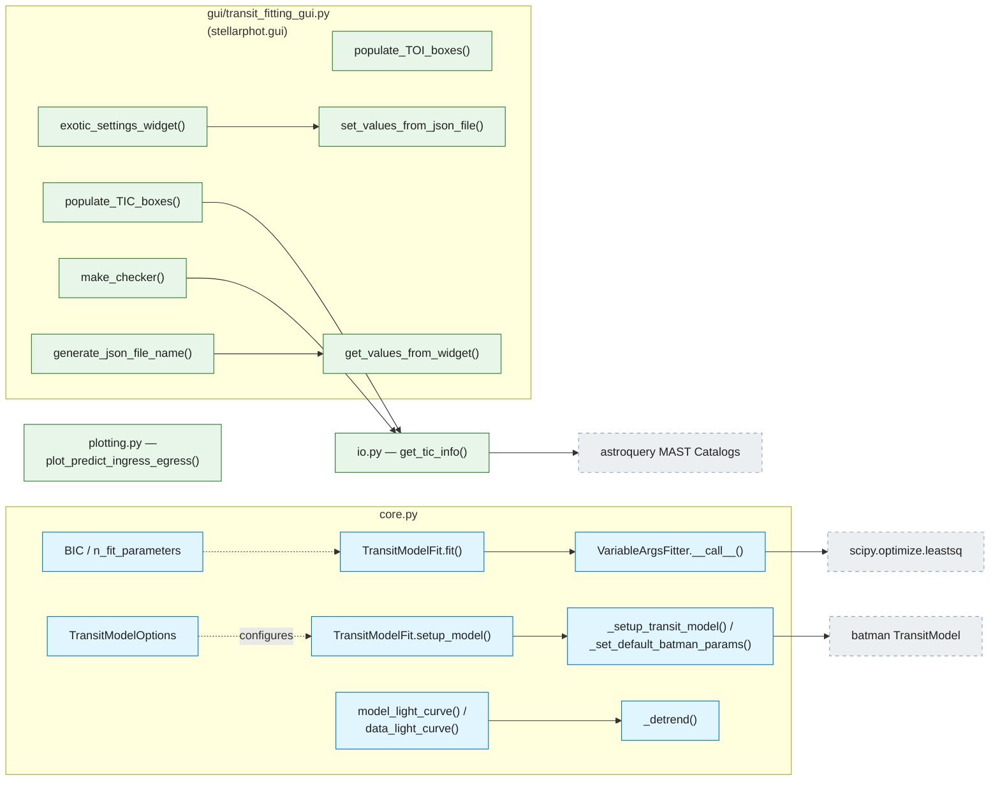
```mermaid
flowchart LR
    classDef cls fill:#e1f5fe,stroke:#0277bd,color:#212121
    classDef fn fill:#e8f5e9,stroke:#2e7d32,color:#212121
    classDef external fill:#eceff1,stroke:#90a4ae,stroke-dasharray: 5 5,color:#212121

    subgraph sg_core["core.py"]
        direction TB
        tmf_setup["TransitModelFit.setup_model()"]:::cls
        tmf_internal["_setup_transit_model() /<br/>_set_default_batman_params()"]:::cls
        tmf_fit["TransitModelFit.fit()"]:::cls
        tmf_lc["model_light_curve() /<br/>data_light_curve()"]:::cls
        tmf_detrend["_detrend()"]:::cls
        tmf_bic["BIC / n_fit_parameters"]:::cls
        fitter["VariableArgsFitter.__call__()"]:::cls
        opts["TransitModelOptions"]:::cls
    end

    subgraph sg_gui["gui/transit_fitting_gui.py<br/>(stellarphot.gui)"]
        direction TB
        exotic["exotic_settings_widget()"]:::fn
        pop_tic["populate_TIC_boxes()"]:::fn
        pop_toi["populate_TOI_boxes()"]:::fn
        checker["make_checker()"]:::fn
        getvals["get_values_from_widget()"]:::fn
        genjson["generate_json_file_name()"]:::fn
        setjson["set_values_from_json_file()"]:::fn
    end

    gettic["io.py — get_tic_info()"]:::fn
    ingress["plotting.py —<br/>plot_predict_ingress_egress()"]:::fn

    batman["batman TransitModel"]:::external
    leastsq["scipy.optimize.leastsq"]:::external
    mast["astroquery MAST Catalogs"]:::external

    tmf_setup --> tmf_internal
    tmf_internal --> batman
    tmf_fit --> fitter
    fitter --> leastsq
    tmf_lc --> tmf_detrend
    tmf_bic -.-> tmf_fit
    opts -.->|"configures"| tmf_setup

    checker --> gettic
    pop_tic --> gettic
    exotic --> setjson
    genjson --> getvals
    gettic --> mast

    click tmf_setup href "../stellarphot/transit_fitting/core.py" "transit_fitting/core.py"
    click tmf_internal href "../stellarphot/transit_fitting/core.py" "transit_fitting/core.py"
    click tmf_fit href "../stellarphot/transit_fitting/core.py" "transit_fitting/core.py"
    click tmf_lc href "../stellarphot/transit_fitting/core.py" "transit_fitting/core.py"
    click tmf_detrend href "../stellarphot/transit_fitting/core.py" "transit_fitting/core.py"
    click tmf_bic href "../stellarphot/transit_fitting/core.py" "transit_fitting/core.py"
    click fitter href "../stellarphot/transit_fitting/core.py" "transit_fitting/core.py"
    click opts href "../stellarphot/transit_fitting/core.py" "transit_fitting/core.py"
    click exotic href "../stellarphot/gui/transit_fitting_gui.py" "gui/transit_fitting_gui.py"
    click pop_tic href "../stellarphot/gui/transit_fitting_gui.py" "gui/transit_fitting_gui.py"
    click pop_toi href "../stellarphot/gui/transit_fitting_gui.py" "gui/transit_fitting_gui.py"
    click checker href "../stellarphot/gui/transit_fitting_gui.py" "gui/transit_fitting_gui.py"
    click getvals href "../stellarphot/gui/transit_fitting_gui.py" "gui/transit_fitting_gui.py"
    click genjson href "../stellarphot/gui/transit_fitting_gui.py" "gui/transit_fitting_gui.py"
    click setjson href "../stellarphot/gui/transit_fitting_gui.py" "gui/transit_fitting_gui.py"
    click gettic href "../stellarphot/transit_fitting/io.py" "transit_fitting/io.py"
    click ingress href "../stellarphot/transit_fitting/plotting.py" "transit_fitting/plotting.py"
```

## [gui/comparison_functions.py](../stellarphot/gui/comparison_functions.py)

*Arrows: **solid** = a direct call or instantiation; **dashed** = file or network I/O, or an optional path.*

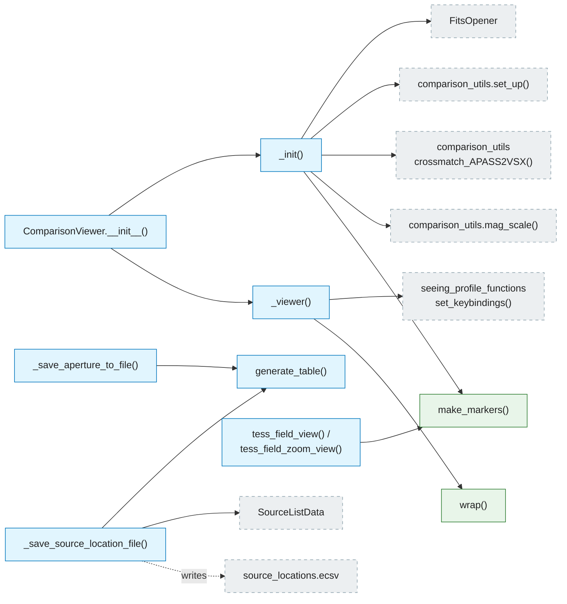
```mermaid
flowchart LR
    classDef cls fill:#e1f5fe,stroke:#0277bd,color:#212121
    classDef fn fill:#e8f5e9,stroke:#2e7d32,color:#212121
    classDef external fill:#eceff1,stroke:#90a4ae,stroke-dasharray: 5 5,color:#212121

    cv_init["ComparisonViewer.__init__()"]:::cls
    cv_setup["_init()"]:::cls
    cv_viewer["_viewer()"]:::cls
    cv_table["generate_table()"]:::cls
    cv_saveloc["_save_source_location_file()"]:::cls
    cv_saveap["_save_aperture_to_file()"]:::cls
    cv_tess["tess_field_view() /<br/>tess_field_zoom_view()"]:::cls
    markers["make_markers()"]:::fn
    wrapfn["wrap()"]:::fn

    fo["FitsOpener"]:::external
    setup_ext["comparison_utils.set_up()"]:::external
    xmatch_ext["comparison_utils<br/>crossmatch_APASS2VSX()"]:::external
    magscale_ext["comparison_utils.mag_scale()"]:::external
    keybind["seeing_profile_functions<br/>set_keybindings()"]:::external
    sld["SourceListData"]:::external
    locfile["source_locations.ecsv"]:::external

    cv_init --> cv_setup
    cv_init --> cv_viewer
    cv_setup --> fo
    cv_setup --> setup_ext
    cv_setup --> xmatch_ext
    cv_setup --> magscale_ext
    cv_setup --> markers
    cv_viewer --> keybind
    cv_viewer --> wrapfn
    cv_saveloc --> cv_table
    cv_saveloc --> sld
    cv_saveloc -.->|"writes"| locfile
    cv_saveap --> cv_table
    cv_tess --> markers

    click cv_init href "../stellarphot/gui/comparison_functions.py" "comparison_functions.py"
    click cv_setup href "../stellarphot/gui/comparison_functions.py" "comparison_functions.py"
    click cv_viewer href "../stellarphot/gui/comparison_functions.py" "comparison_functions.py"
    click cv_table href "../stellarphot/gui/comparison_functions.py" "comparison_functions.py"
    click cv_saveloc href "../stellarphot/gui/comparison_functions.py" "comparison_functions.py"
    click cv_saveap href "../stellarphot/gui/comparison_functions.py" "comparison_functions.py"
    click cv_tess href "../stellarphot/gui/comparison_functions.py" "comparison_functions.py"
    click markers href "../stellarphot/gui/comparison_functions.py" "comparison_functions.py"
    click wrapfn href "../stellarphot/gui/comparison_functions.py" "comparison_functions.py"
    click fo href "../stellarphot/gui/fits_opener.py" "fits_opener.py"
    click setup_ext href "../stellarphot/utils/comparison_utils.py" "comparison_utils.py"
    click xmatch_ext href "../stellarphot/utils/comparison_utils.py" "comparison_utils.py"
    click magscale_ext href "../stellarphot/utils/comparison_utils.py" "comparison_utils.py"
    click keybind href "../stellarphot/gui/seeing_profile_functions.py" "seeing_profile_functions.py"
    click sld href "../stellarphot/core.py" "core.py"
```

## [gui](../stellarphot/gui/) — seeing profile and TESS analysis widgets

*Arrows: **solid** = a direct call or instantiation; **dashed** = file or network I/O, or an optional path.*

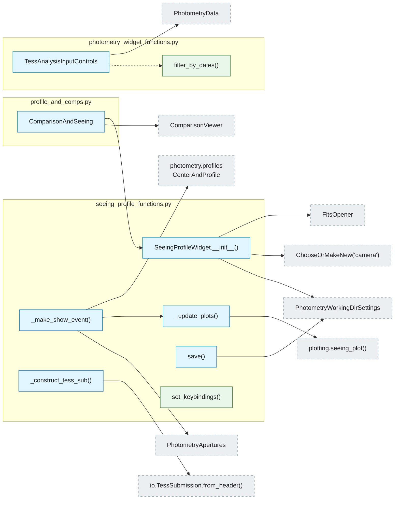
```mermaid
flowchart LR
    classDef cls fill:#e1f5fe,stroke:#0277bd,color:#212121
    classDef fn fill:#e8f5e9,stroke:#2e7d32,color:#212121
    classDef external fill:#eceff1,stroke:#90a4ae,stroke-dasharray: 5 5,color:#212121

    subgraph sg_seeing["seeing_profile_functions.py"]
        direction TB
        spw_init["SeeingProfileWidget.__init__()"]:::cls
        spw_show["_make_show_event()"]:::cls
        spw_plots["_update_plots()"]:::cls
        spw_save["save()"]:::cls
        spw_tess["_construct_tess_sub()"]:::cls
        keybind["set_keybindings()"]:::fn
    end

    subgraph sg_combined["profile_and_comps.py"]
        direction TB
        cas["ComparisonAndSeeing"]:::cls
    end

    subgraph sg_taic["photometry_widget_functions.py"]
        direction TB
        taic["TessAnalysisInputControls"]:::cls
        fbd["filter_by_dates()"]:::fn
    end

    fo["FitsOpener"]:::external
    cmn["ChooseOrMakeNew('camera')"]:::external
    pwds["PhotometryWorkingDirSettings"]:::external
    cap["photometry.profiles<br/>CenterAndProfile"]:::external
    splot["plotting.seeing_plot()"]:::external
    apert["PhotometryApertures"]:::external
    tsub["io.TessSubmission.from_header()"]:::external
    cviewer["ComparisonViewer"]:::external
    pdata["PhotometryData"]:::external

    spw_init --> fo
    spw_init --> cmn
    spw_init --> pwds
    spw_show --> cap
    spw_show --> spw_plots
    spw_plots --> splot
    spw_show --> apert
    spw_save --> pwds
    spw_tess --> tsub

    cas --> spw_init
    cas --> cviewer

    taic --> pdata
    taic -.-> fbd

    click spw_init href "../stellarphot/gui/seeing_profile_functions.py" "seeing_profile_functions.py"
    click spw_show href "../stellarphot/gui/seeing_profile_functions.py" "seeing_profile_functions.py"
    click spw_plots href "../stellarphot/gui/seeing_profile_functions.py" "seeing_profile_functions.py"
    click spw_save href "../stellarphot/gui/seeing_profile_functions.py" "seeing_profile_functions.py"
    click spw_tess href "../stellarphot/gui/seeing_profile_functions.py" "seeing_profile_functions.py"
    click keybind href "../stellarphot/gui/seeing_profile_functions.py" "seeing_profile_functions.py"
    click cas href "../stellarphot/gui/profile_and_comps.py" "profile_and_comps.py"
    click taic href "../stellarphot/gui/photometry_widget_functions.py" "photometry_widget_functions.py"
    click fbd href "../stellarphot/gui/photometry_widget_functions.py" "photometry_widget_functions.py"
    click fo href "../stellarphot/gui/fits_opener.py" "fits_opener.py"
    click cmn href "../stellarphot/gui/custom_widgets.py" "custom_widgets.py"
    click pwds href "../stellarphot/settings/settings_files.py" "settings_files.py"
    click cap href "../stellarphot/photometry/profiles.py" "profiles.py"
    click splot href "../stellarphot/plotting/aij_plots.py" "aij_plots.py"
    click apert href "../stellarphot/settings/models.py" "models.py"
    click tsub href "../stellarphot/io/tess.py" "io/tess.py"
    click cviewer href "../stellarphot/gui/comparison_functions.py" "comparison_functions.py"
    click pdata href "../stellarphot/core.py" "core.py"
```

## [plotting/](../stellarphot/plotting/)

*Arrows: **solid** = a direct call or instantiation; **dashed** = file or network I/O, or an optional path.*

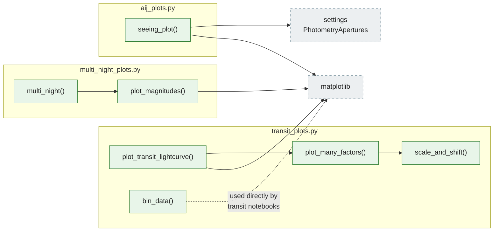
```mermaid
flowchart LR
    classDef fn fill:#e8f5e9,stroke:#2e7d32,color:#212121
    classDef external fill:#eceff1,stroke:#90a4ae,stroke-dasharray: 5 5,color:#212121

    subgraph sg_transit["transit_plots.py"]
        direction TB
        ptl["plot_transit_lightcurve()"]:::fn
        pmf["plot_many_factors()"]:::fn
        sas["scale_and_shift()"]:::fn
        bindata["bin_data()"]:::fn
    end

    subgraph sg_multi["multi_night_plots.py"]
        direction TB
        mn["multi_night()"]:::fn
        pmag["plot_magnitudes()"]:::fn
    end

    subgraph sg_aij["aij_plots.py"]
        direction TB
        splot["seeing_plot()"]:::fn
    end

    apert["settings<br/>PhotometryApertures"]:::external
    mpl["matplotlib"]:::external

    ptl --> pmf
    pmf --> sas
    mn --> pmag
    splot --> apert
    ptl --> mpl
    pmag --> mpl
    splot --> mpl
    bindata -.->|"used directly by<br/>transit notebooks"| mpl

    click ptl href "../stellarphot/plotting/transit_plots.py" "transit_plots.py"
    click pmf href "../stellarphot/plotting/transit_plots.py" "transit_plots.py"
    click sas href "../stellarphot/plotting/transit_plots.py" "transit_plots.py"
    click bindata href "../stellarphot/plotting/transit_plots.py" "transit_plots.py"
    click mn href "../stellarphot/plotting/multi_night_plots.py" "multi_night_plots.py"
    click pmag href "../stellarphot/plotting/multi_night_plots.py" "multi_night_plots.py"
    click splot href "../stellarphot/plotting/aij_plots.py" "aij_plots.py"
    click apert href "../stellarphot/settings/models.py" "models.py"
```

## [utils/](../stellarphot/utils/) — magnitude transforms and comparison helpers

*Arrows: **solid** = a direct call or instantiation; **dashed** = file or network I/O, or an optional path.*

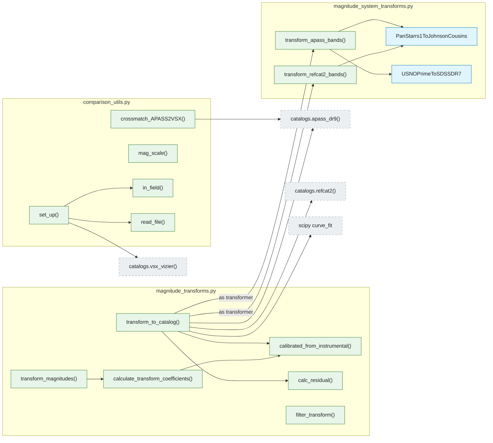
```mermaid
flowchart LR
    classDef cls fill:#e1f5fe,stroke:#0277bd,color:#212121
    classDef fn fill:#e8f5e9,stroke:#2e7d32,color:#212121
    classDef external fill:#eceff1,stroke:#90a4ae,stroke-dasharray: 5 5,color:#212121

    subgraph sg_mag["magnitude_transforms.py"]
        direction TB
        t2c["transform_to_catalog()"]:::fn
        tmags["transform_magnitudes()"]:::fn
        ctc["calculate_transform_coefficients()"]:::fn
        cfi["calibrated_from_instrumental()"]:::fn
        resid["calc_residual()"]:::fn
        ftrans["filter_transform()"]:::fn
    end

    subgraph sg_sys["magnitude_system_transforms.py"]
        direction TB
        tab["transform_apass_bands()"]:::fn
        trb["transform_refcat2_bands()"]:::fn
        ps1["PanStarrs1ToJohnsonCousins"]:::cls
        usno["USNOPrimeToSDSSDR7"]:::cls
    end

    subgraph sg_comp["comparison_utils.py"]
        direction TB
        setup["set_up()"]:::fn
        xmatch["crossmatch_APASS2VSX()"]:::fn
        magscale["mag_scale()"]:::fn
        infield["in_field()"]:::fn
        readfile["read_file()"]:::fn
    end

    apass["catalogs.apass_dr9()"]:::external
    refcat["catalogs.refcat2()"]:::external
    vsx["catalogs.vsx_vizier()"]:::external
    curvefit["scipy curve_fit"]:::external

    t2c --> apass
    t2c --> refcat
    t2c -->|"as transformer"| tab
    t2c -->|"as transformer"| trb
    t2c --> curvefit
    t2c --> cfi
    t2c --> resid
    tmags --> ctc
    ctc --> cfi
    tab --> ps1
    trb --> ps1
    tab --> usno

    setup --> vsx
    setup --> infield
    setup --> readfile
    xmatch --> apass

    click t2c href "../stellarphot/utils/magnitude_transforms.py" "magnitude_transforms.py"
    click tmags href "../stellarphot/utils/magnitude_transforms.py" "magnitude_transforms.py"
    click ctc href "../stellarphot/utils/magnitude_transforms.py" "magnitude_transforms.py"
    click cfi href "../stellarphot/utils/magnitude_transforms.py" "magnitude_transforms.py"
    click resid href "../stellarphot/utils/magnitude_transforms.py" "magnitude_transforms.py"
    click ftrans href "../stellarphot/utils/magnitude_transforms.py" "magnitude_transforms.py"
    click tab href "../stellarphot/utils/magnitude_system_transforms.py" "magnitude_system_transforms.py"
    click trb href "../stellarphot/utils/magnitude_system_transforms.py" "magnitude_system_transforms.py"
    click ps1 href "../stellarphot/utils/magnitude_system_transforms.py" "magnitude_system_transforms.py"
    click usno href "../stellarphot/utils/magnitude_system_transforms.py" "magnitude_system_transforms.py"
    click setup href "../stellarphot/utils/comparison_utils.py" "comparison_utils.py"
    click xmatch href "../stellarphot/utils/comparison_utils.py" "comparison_utils.py"
    click magscale href "../stellarphot/utils/comparison_utils.py" "comparison_utils.py"
    click infield href "../stellarphot/utils/comparison_utils.py" "comparison_utils.py"
    click readfile href "../stellarphot/utils/comparison_utils.py" "comparison_utils.py"
    click apass href "../stellarphot/catalogs.py" "catalogs.py"
    click refcat href "../stellarphot/catalogs.py" "catalogs.py"
    click vsx href "../stellarphot/catalogs.py" "catalogs.py"
```

## [table_representations.py](../stellarphot/table_representations.py) + [utils/version_migrator.py](../stellarphot/utils/version_migrator.py)

*Arrows: **solid** = a direct call or instantiation; **dashed** = file or network I/O, or an optional path.*

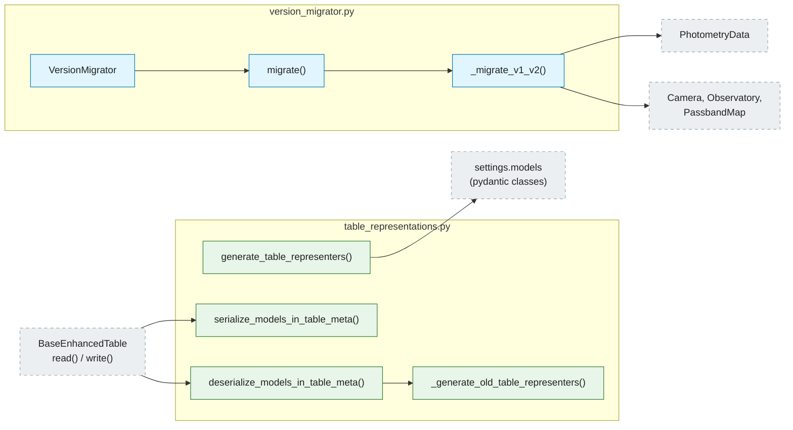
```mermaid
flowchart LR
    classDef cls fill:#e1f5fe,stroke:#0277bd,color:#212121
    classDef fn fill:#e8f5e9,stroke:#2e7d32,color:#212121
    classDef external fill:#eceff1,stroke:#90a4ae,stroke-dasharray: 5 5,color:#212121

    subgraph sg_trep["table_representations.py"]
        direction TB
        gen_rep["generate_table_representers()"]:::fn
        ser["serialize_models_in_table_meta()"]:::fn
        deser["deserialize_models_in_table_meta()"]:::fn
        old_rep["_generate_old_table_representers()"]:::fn
    end

    subgraph sg_mig["version_migrator.py"]
        direction TB
        vm["VersionMigrator"]:::cls
        vm_migrate["migrate()"]:::cls
        vm_v1v2["_migrate_v1_v2()"]:::cls
    end

    models["settings.models<br/>(pydantic classes)"]:::external
    bet_rw["BaseEnhancedTable<br/>read() / write()"]:::external
    pdata["PhotometryData"]:::external
    camobs["Camera, Observatory,<br/>PassbandMap"]:::external

    gen_rep --> models
    bet_rw --> ser
    bet_rw --> deser
    deser --> old_rep

    vm --> vm_migrate
    vm_migrate --> vm_v1v2
    vm_v1v2 --> pdata
    vm_v1v2 --> camobs

    click gen_rep href "../stellarphot/table_representations.py" "table_representations.py"
    click ser href "../stellarphot/table_representations.py" "table_representations.py"
    click deser href "../stellarphot/table_representations.py" "table_representations.py"
    click old_rep href "../stellarphot/table_representations.py" "table_representations.py"
    click vm href "../stellarphot/utils/version_migrator.py" "version_migrator.py"
    click vm_migrate href "../stellarphot/utils/version_migrator.py" "version_migrator.py"
    click vm_v1v2 href "../stellarphot/utils/version_migrator.py" "version_migrator.py"
    click models href "../stellarphot/settings/models.py" "models.py"
    click bet_rw href "../stellarphot/core.py" "core.py"
    click pdata href "../stellarphot/core.py" "core.py"
    click camobs href "../stellarphot/settings/models.py" "models.py"
```
